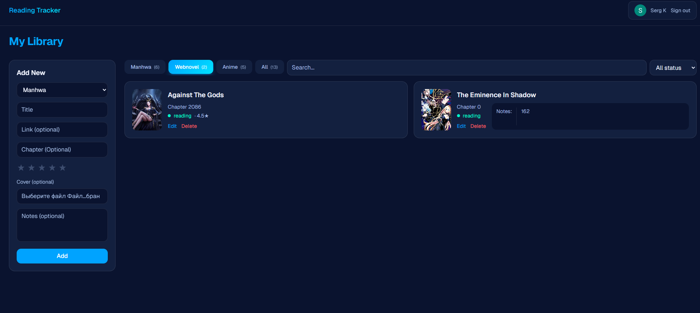

# Reading Tracker

Track your manhwa, webnovels, and anime — with cover images, ratings, notes, and progress.
Built with Next.js 15, TypeScript, Prisma, and Cloudinary.

**Live demo:** https://reading-tracker-weld.vercel.app/
No signup needed - click **Try the demo** on the sign-in page.

## Features

- GitHub and Google OAuth (NextAuth v5)
- Per-user reading list with full CRUD
- Cover image upload (Cloudinary)
- Star ratings with half-star precision
- Status tracking (reading / completed / dropped)
- Type tabs (manhwa / webnovel / anime / all) with counts
- Search and status filter
- Tab state persisted in URL
- Mobile-responsive: sidebar form on desktop, sheet on mobile
- Inline edit with modal
- Loading + error states for all mutations
- **Demo mode** - one-click demo login with seeded data, auto-reset daily via Vercel cron
- Error tracking with Sentry
- Unit tests (Vitest + React Testing Library) run in CI (GitHub Actions)

## Stack

- **Framework:** Next.js 15 (App Router, server components, server actions)
- **Language:** TypeScript
- **Database:** PostgreSQL (Neon) + Prisma 7
- **Auth:** NextAuth v5
- **Forms:** React Hook Form + Zod validation
- **Image upload:** Cloudinary
- **Error tracking:** Sentry
- **Styling:** Tailwind CSS v4
- **Tests:** Vitest + React Testing Library
- **Deploy / CI:** Vercel + GitHub Actions

## Local setup

\`\`\`bash
git clone https://github.com/Sergei1790/reading-tracker.git
cd reading-tracker
npm install
cp .env.example .env  # fill in real values
npx prisma migrate dev
npm run dev
\`\`\`

## Notes

Part of a learning roadmap to land a remote dev role. Most interesting parts to build: Cloudinary image upload flow, custom half-star rating component, and URL-synced tab state.
